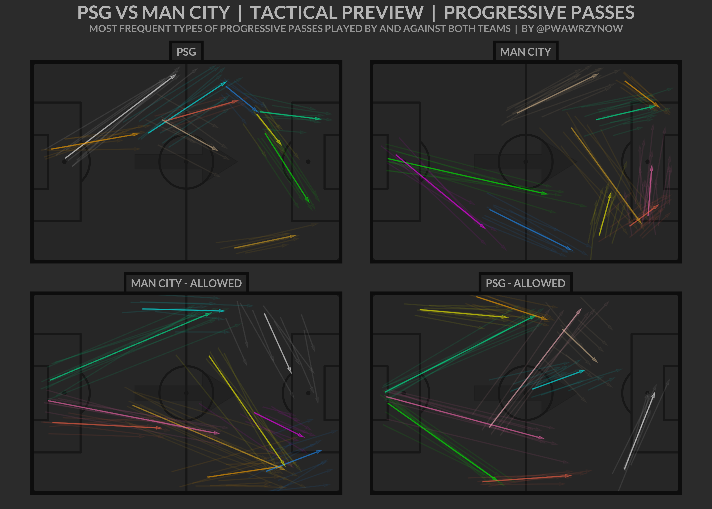

# Pass-Clustering

Project template for clustering passes in football. Performs basic clustering (OPTICS algorithm) and generates vizualization with results:

Repo doesn't contain any data parsing besides filtering progressive passes (a pass is progressive when it gets a team closer to the opposite goal by at least 25%). To run main.ipynb, you need to supply your own csv with passes (see _scripts/metadata.py for more info on the format) and a field-plotting function (draw_field(matplotlib.axes.Axes ax) at _scripts/field.py).

Where I'd consider going with this project forward:
* **Automating viz generation** - Now this process is mostly hardcoded which is fine only as long as you don't need to use it frequently. It would be nice if it supported more teams on a single graphic or other layouts and didn't require to modify team names by hand in a hundred places.
* **Improving the clustering method** - I didn't really do much experimenting in this area, just used what worked for my combinations (https://wawrzynow.wordpress.com/2021/01/06/introducing-passing-combinations/) but there probably is a better algorithm and/or set of hyperparams to use.
* **Engineering new features** - I thought of adding some more advanced features to the party (like e.g. whether a pass is made during a counter or a positional attack, maybe whether the ball is chipped etc). This could allow to capture even more context and produce even more insight but also potentially harm explainability and make the above vizualization useless.
* **Performing clustering on different types of passes separately** - basically do the above thing but split passes before clustering (so cluster counter-attacking passes separately from positional-attack ones, the same could be useful for deep and high passes etc). Would produce a great level of insight and not harm the vizualization method (would probably require some modifications to the template though).
